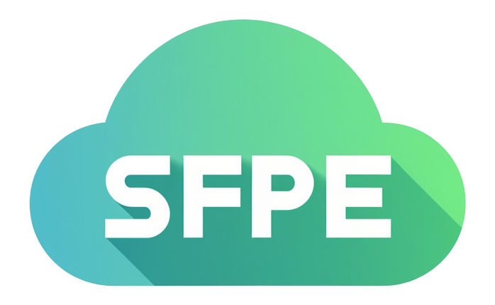

# sfpecli
**sfpe** is a command-line interface (CLI) application for working with Salesforce Platform Events. With this CLI, you can subscribe to platform events and Change Data Capture events, publish platform events, and listen to events within Salesforce or any other system subscribed to those platform events.

## Features
**Subscribe to Platform Events:** Subscribe with a replayId to receive all platform events published after that replayId. You can also specify the number of events to receive.   
**Publish Platform Events:** Publish platform events directly from the CLI.    
**Authentication Management:** Store and manage authenticated connections securely.    

See command line help with -h or --help parameters of the cli.

To install CLI

```bash
npm install sfpecli -g
```

For CLI help:

```bash
sfpe -h
```

## Authenticated Connection Details
Authenticated connections are stored in OS-specific temporary storage. Access tokens are stored as encrypted strings. You can override the encryption key using the SFPE_ENCRYPTION_KEY environment variable.   
To allow CLI to authenticate you need to create and configure a connected app in Salesforce.

## Alias
Most commands, except list, require an alias. When you authenticate against a Salesforce org, you need to provide an alias, which is used for subsequent platform event commands. The list command displays all available authenticated connections, but note that available connections may have expired access tokens. If a token is expired, re-authentication is required. You can use any string without white spaces as org alias.


## Authentication Methods
Below 3 authorization flows are supported. For all available flags see commands help with -h flag.   

### Using Username and Password OAuth Flow
You can use **aup** subcommand to authorize in Salesforce using username and password by providing the required inputs into CLI. This flow is not recommended to be used in production orgs. Optionally you can provide instance url.
```bash
sfpe aup -a <org_alias> -u <salesforce_username> --token <security_token> -p <password>  -s <client_secret> -c <client_id>
```
### Using client credential flow
You can use **acc** subcommand to authorize in Salesforce using client credentials flow. This flow only require client_id and client_secret.
```bash
sfpe acc -a <org_alias>  -s <client_secret> -c <client_id> -l <instance_url>
```
### Using jwt flow
You can use **awt** subcommand to authorize in Salesforce using jwt flow.This flow requires RS256 based private and public keys pair.
```bash
sfpe awt -a <org_alias>  -c <client_id> -u <salesforce_username> -f <private_key_filepath>
```
## Platform events commands

### Subscribe to platform events
```bash
sfpe evtsub -a <org_alias> -t <platformevent_or_changeevent>
# Note: org_alias is alias of already athenticated org, make sure authentication is still valid (valid access_token).
```
You can provide number of events to receive with -n flag.   
Also you can provide replayId to receive all events published after that replayId, like shown below.
```bash
sfpe evtsub -a <org_alias> -t <platformevent_or_changeevent> -n 10 -r 18932
# This gives you 10 events published after replayId 18932
```

### Publishing platform events
```bash
sfpe evtpub -a <org_alias> -t <platform_event> -m <"any_text_string">
```
If you need to pass JSON, you can use stringified json in the message input for command.

### To get code for development
Clone the git repository  

install dependencies:

```bash
npm install
```

### Roadmap
1. Implemntation of refresh token flow.